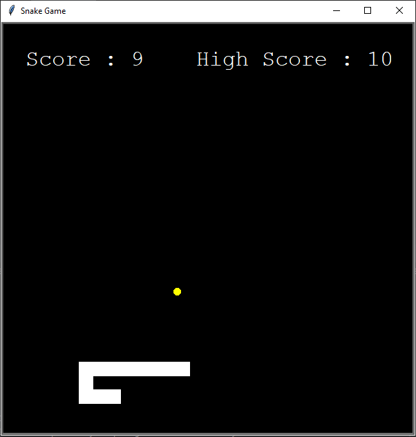

# Classic 70's Game: Snake

Welcome to the Snake Game repository! This is a classic Snake game implementation in Python, where the player control a snake that grows in length as it eats food while avoiding collisions with walls and its own body.

## About the Game

The Snake Game is a classic and timeless arcade game that has entertained generations of players. In this implementation, you'll experience the thrill of controlling a snake as it navigates a grid, devouring food to grow longer. Your task is to guide the snake while avoiding collisions with walls and its own body. It's a game of strategy, reflexes, and careful planning.

## Features

- 🐍 Classic Snake gameplay.
- 🏆 Higher score and in-game score tracking: Compete with yourself and others.
- 🎮 Responsive Controls: The snake will respond instantly to your inputs, allowing you to maneuver through the grid with precision.
- ⬆️ Growth Mechanics: Each time the snake consumes a piece of food, it grows in length. You need to manage the snake's increasing size while avoiding obstacles.
- 🎯 Engaging Gameplay: The Snake Game offers a simple yet addictive gameplay loop that keeps you engaged. As you master the controls and develop strategies, you'll find yourself striving to reach new levels of skill and accomplishment.
- 🕹️ Classic Appeal: With its nostalgic graphics and familiar mechanics, the Snake Game captures the essence of retro gaming. It's a nod to the past while offering a fresh experience for players of all ages.

Whether you're looking to relive the excitement of playing Snake on old-school devices or you're discovering the game for the first time, the Snake Game is a delightful and entertaining choice. Get ready to immerse yourself in the challenge of guiding the snake to victory while enjoying a dose of gaming nostalgia.

## How to Play

1. Use the up, down, left and right arrow keys on your keyboard to control the snake's movement.
2. Eat the food to increase your score.
3. Each time the snake consumes a piece of food, it grows in length. 
4. Avoid collisions with walls and your own body.
5. The game ends when the snake collides with a wall or itself.

## Get Started

1. Clone this repository to your local machine.
2. Open folder in your development environment
3. Run the `main.py` file.
4. Enjoy the Snake experience and have a blast!

## Contributing

We welcome contributions to enhance and expand the game! Whether you're a developer, designer, or gamer with ideas, feel free to contribute by forking the repository, making your changes, and submitting a pull request.

Play, modify, and share your versions of the game as you like!

Enjoy playing the Snake Game and have fun coding! 

---
Created with ❤️ by Maria Grazia (https://github.com/mgnorero)
